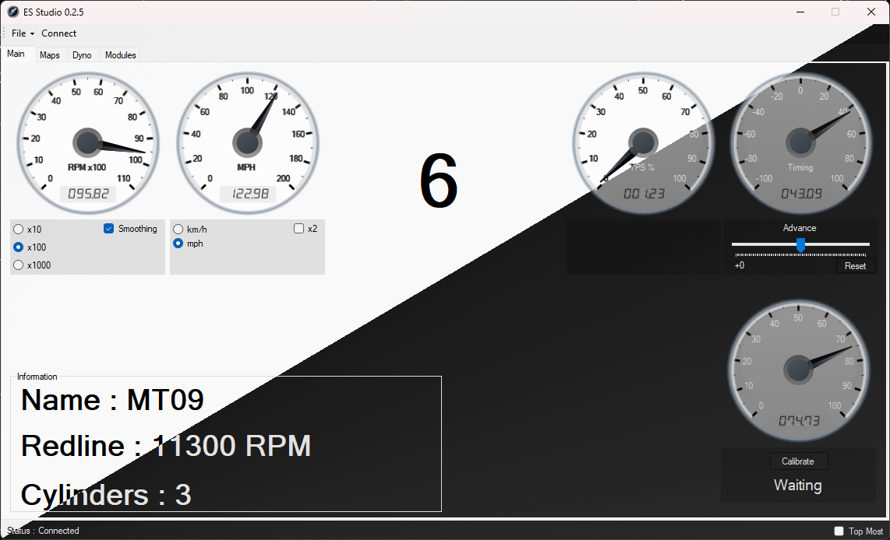
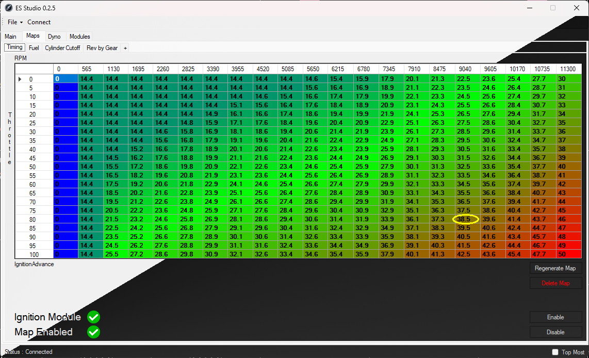
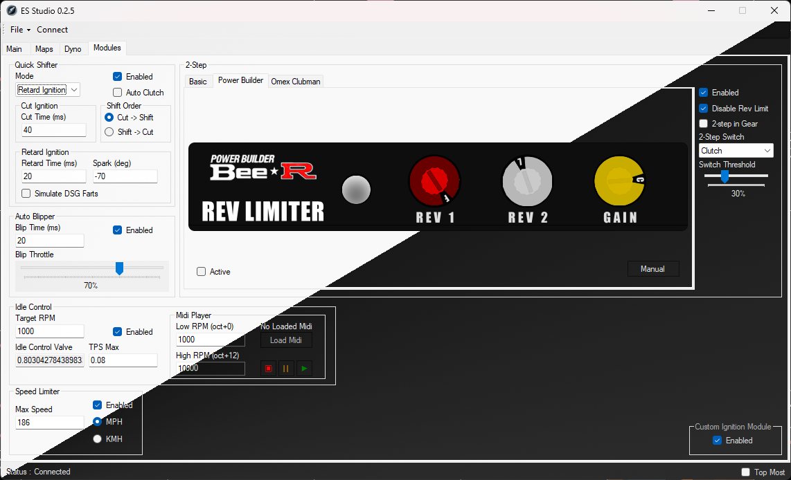

  

<h1 align="center">ES-Studio</h1>
<h4 align="center">Tuning Engine Simulator with ES-Studio</h4>

  

  
  

# What exactly is this?
ES-Studio (Engine Simulator Studio) is a program to simulate an ECU for Engine Simulator. The idea behind the project was inspired by Tuner Studio. The original idea was to simulate an ECU that Tuner Studio could understand and have that ECU act as a proxy between Engine Simulator and this software but I prefered to create my own user interface. ES-Studio is still under heavy development and everything is subject to change!

# Features
- RPM gauge with configurable units and smoothing
- Speed gauge that can be switched between km/h and mph
- Throttle position gauge
- Timing gauge with real-time spark advance adjustment
- Customizable 2D engine paramater maps with multiple input and output paramaters
- Advanced Dyno logger (coming soon)
- Drag strip simulation for 1/4 mile, 1/2 mile and 1 mile times (coming soon)
- Advanced quick shifter to cut or retard ignition during a gear shift that has customizable shift order, cut time, spark angle and automatic clutch control
- Advanced auto blipper to "blip" the throttle during a down shift that has customizable blip time and throttle amount
- Idle control
- Midi player so you can make an engine play music (rev to each note)
- Speed limiter to limit top speed in mph or km/h
- Custom ignition module
- Advanced 2-step rev limiter with cut time or ignition retard (in deg) and 4 limiter modes
- Ability to disable Engine Simulators default rev limit
- Customizable 2-step triggers
- Customizable 2-step engagement threshold
- Ability to use rolling 2-step
- Accurate simulation of the BEE*R 2-step rev limiter
- Accurate simulation of the Omex Clubman rev limiter (coming soon)

# Supported Version(s)
- Engine Simulator v0.1.14a+

# Known Bugs
- ~~You must restart the GUI if you have disconnected from Engine Simulator or if Engine Simulator has been closed~~
- Small chance of crashing when switching between engines
- ~~Spark table can become unreadable for high RPM engines~~

# Building
- Ensure you have Visual Studio with C++ and C# installed
- Build the solution as RELEASE
- Executable found in ES-Studio\ES-GUI\bin\Release\
